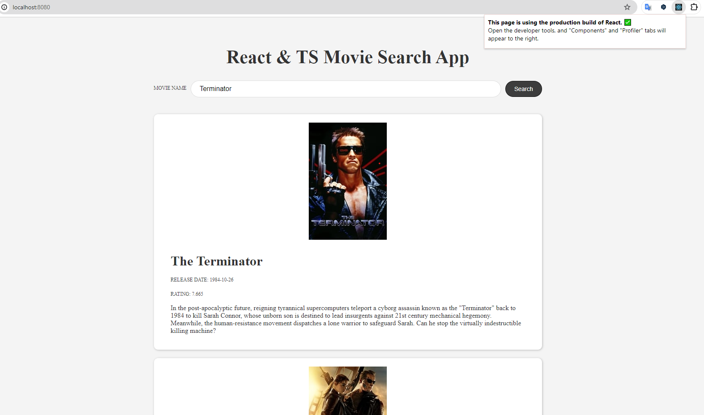

# React + TypeScript Movie Search App

This is a simple movie search app built with React and TypeScript. It uses the [movieDB API](https://www.themoviedb.org/) to fetch movie data.

## Features

- Search for movies
- View movie details
- View movie release date
- View movie rating

## Technologies

- React
- TypeScript
- React Query
- Docker

## Local Installation

1. Clone the repository
2. Run `npm install`
3. Create a `.env` file in the root directory and add your API key like so: `VITE_API_KEY=your_api_key_here`
4. Run `npm run dev` to start the development server

## Docker Installation

1. Clone the repository
2. Run `docker-compose up --build` to build and start the container

## Screenshots

